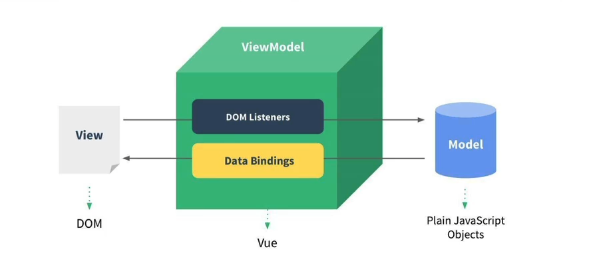

# Vue3开发

目前前端最主要流行的三大框架：Vue、React、Angular，Vue在国内的市场占有率是最高的。

文档：https://v3.cn.vuejs.org/

### Vue3 带来的变化

- 源码通过monorepo的形式来管理源码
- 源码使用TypeScript来进行重写
- 使用了Proxy进行数据劫持。以往Vue2使用的是definedProperty来进行数据劫持
- 删除了一些非必要的api
- 编译方面，对Block Tree、Slot编译优化、diff算法优化
- 由Options API 转到 Composition API。让代码结构更加的简洁，可抽取的复用代码更多
- Hooks函数增加代码的复用性

### MVVM 模型

Vue并没有完全遵守MVVM的模型，但是整个设计是受到他们的启发的，通常情况下我们也可以说Vue是MVVM模型的一种。MVVM （Model-View-ViewModel ），一种基于前端开发的架构模式，其核心是提供对View 和 ViewModel 的双向数据绑定，**当ViewModel 的状态改变可以自动传递给 View**，即所谓的数据双向绑定（数据驱动视图发生变化）。

Vue在MVVM模型中所扮演的角色如下图：

### 如何调试Vue的源码

